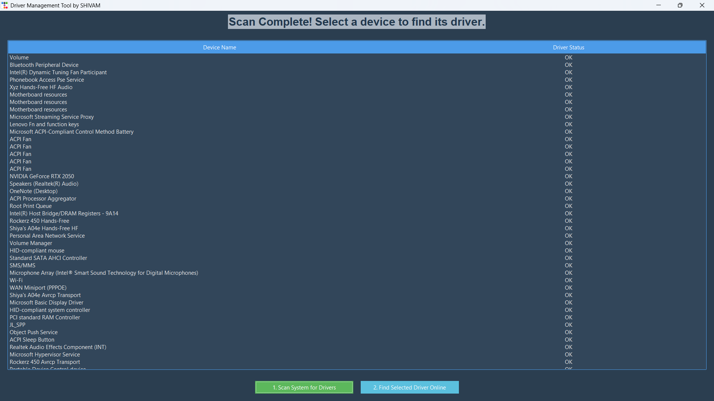

# Driver Management Tool 🚀

A simple yet powerful desktop application built in Python to help users scan, identify, and find drivers for their Windows PC.

Ek aasan desktop application jo users ko unke Windows PC ke liye drivers scan karne, unki sthiti jaanne, aur unhe online dhoondhne mein madad karti hai.

## 📸 Screenshot



---

## ✨ Features (Visheshtayein)

- **Modern & Clean UI:** `ttkbootstrap` ka istemal karke banaya gaya ek saaf aur aakarshak user interface.
- **System Hardware Scan:** Ek click mein aapke computer ke sabhi hardware components ko scan karta hai.
- **Driver Status Check:** Har device ke driver ka status (jaise "OK", "Error") dikhata hai.
- **One-Click Online Search:** List mein se kisi bhi device ko select karke uske liye online drivers aasani se dhoondhne ki suvidha.

---

## 🛠️ Technology Stack (Istemal Ki Gayi Technology)

- **Language:** Python 3
- **GUI Framework:** Tkinter, ttkbootstrap (for modern themes)
- **Core Libraries:**
  - `WMI`: Windows Management Instrumentation se system hardware ki jaankari nikalne ke liye.
  - `webbrowser`: User ke default browser mein search results kholne ke liye.

---

## ⚙️ Setup and Installation (Kaise Install Karein)

Is project ko apne local machine par chalaane ke liye neeche diye gaye steps follow karein.

**1. Prerequisites (Zaruri Cheezein):**
   - Aapke system mein Python 3 install hona chahiye.

**2. Clone the Repository:**
   ```bash
   git clone [https://github.com/](https://github.com/)[shivamg0520]/[driver-management].git
   cd [driver-management]
   ```

**3. Install Dependencies (Zaruri Libraries Install Karein):**
   Is project ke liye zaruri libraries ko install karne ke liye neeche di gayi command chalayein:
   ```bash
   pip install wmi ttkbootstrap
   ```

**4. Run the Application (Application Chalayein):**
   ```bash
   python driver_app.py
   ```

---

## 🚀 How to Use (Kaise Istemal Karein)

1.  Application ko `python driver_app.py` se start karein.
2.  **"1. Scan System for Drivers"** button par click karein aur scan poora hone ka intezar karein.
3.  Table mein se us device ko select karein jiska driver aap dhoondhna chahte hain.
4.  **"2. Find Selected Driver Online"** button par click karein. Aapka browser us driver ke search results ke saath khul jaayega.

---

## 🔮 Future Scope (Bhavishya Ki Sambhavnayein)

Is project ko aur behtar banane ke liye future mein yeh features add kiye ja sakte hain:

- **Automated Link Finding:** Google search kholne ke bajaye, web scraping ka use karke direct download link dhundhna.
- **Silent Installation:** User ko bina pareshan kiye drivers ko background mein automatically install karna.
- **Driver Backup & Restore:** Maujooda drivers ka backup lena aur zaroorat padne par unhe restore karna.

---

## 📄 License

This project is licensed under the MIT License. Adhik jaankari ke liye `LICENSE` file dekhein.

---

Created with ❤️ by **SHIVAM**
